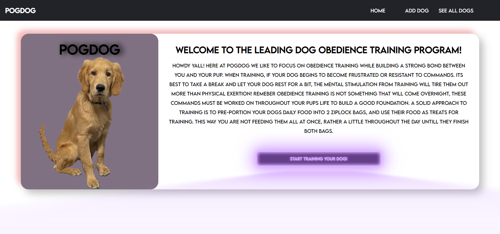

# PogDog

## Project Description

- PogDog is a webapp created in order to aid useres in basic obedience training for their dog.
- I created the app because i recently got a puppy and have been spending countless hours training him and see a need for a resource like this.
- This app is the foundations capstone project for my DevMountain coding bootcamp course, we were given a 10 day sprint to create an app from scratch.

## Technology used

- Java Script
- HTML
- CSS
- Axios
- Dog API

## Application Features

- Users are able to create a profile for their dog.
- Users are able to see a spread of all the dogs they are currently training.
- Users can train a specific dog and be shown commands depending on what level they are.
- Dogs can independently level and train.
